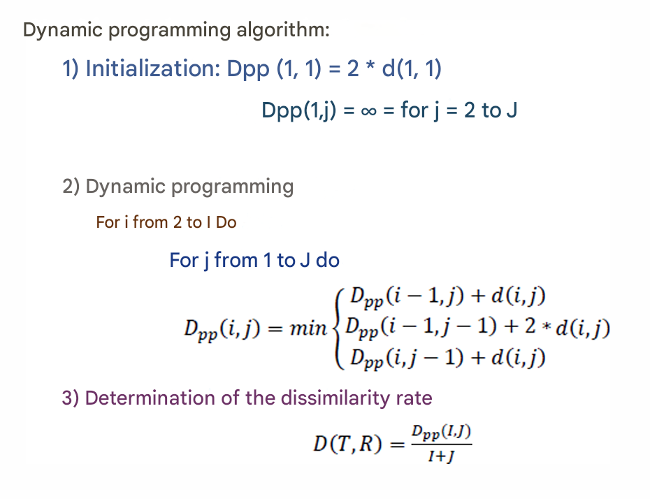

# Dynamic Programming

*Dynamic programming* is an effective technique for solving optimization problems that can be broken down into nested sub-problems. 

In pattern recognition, dynamic programming is used for _temporal registration_, which consists in aligning two temporal signals by finding the best temporal offset between them.

**Temporal Registration**

_Temporal registration_ aims to find the best temporal offset between two temporal signals by minimizing a cost function, which measures the difference between the two signals.

**Registration Path**

_Registration path_ represent the different possible combinations of time shifts between the two signals. The aim is to find the optimal shift path that minimizes the cost function.

# Dynamic Programming Algorithm

